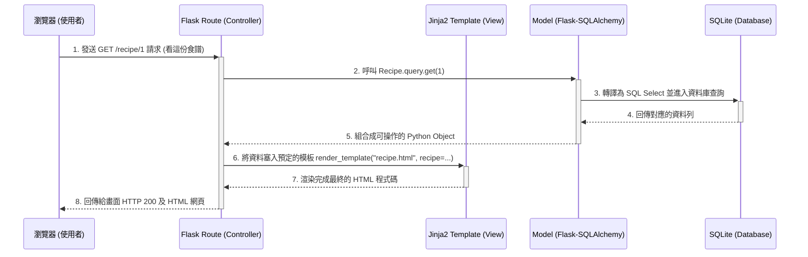

# 系統架構文件 (Architecture) - 食譜收藏夾系統

## 1. 技術架構說明

### 選用技術與原因
- **後端框架**：**Python + Flask**
  - **原因**：Flask 是一套輕量級的網頁框架，開發速度快且具有高度彈性。適合這類規模較小的 MVP 專案，讓開發者專注於功能實作，不過度設計。
- **模板引擎**：**Jinja2**
  - **原因**：與 Flask 高度整合，能直接將後端的資料傳遞到前端 HTML 內進行渲染。因為本專案不需要前後端分離，使用 Jinja2 渲染伺服器端頁面能加速開發，也對 SEO 較友善。
- **資料庫**：**SQLite (透過 SQLAlchemy)**
  - **原因**：SQLite 零設定配置，資料僅存為單一檔案，部署與備份都十分容易。對於食譜網站初期的流量與存取規模來說已經足夠。我們將搭配 Flask-SQLAlchemy 處理 ORM 映射。

### Flask MVC 模式說明
本專案的設計理念參考傳統的 MVC 架構（Model-View-Controller）來組織程式碼：
- **Model (資料模型)**：負責定義資料庫的結構以及對資料的 CRUD 操作（例如：食譜、使用者、食材、留言）。本系統會放置於 `models/` 目錄。
- **View (視圖)**：負責呈現資料給使用者看，也就是 HTML 頁面外觀。Jinja2 模板會放置於 `templates/` 目錄，並結合 `static/` 下的 CSS 與圖片呈現。
- **Controller (控制器)**：接收使用者的請求 (Request)，向 Model 要資料或修改資料，最後將資料交給 View 來渲染回傳。在 Flask 中這是由 **Routes (路由)** 負責，會放置於 `routes/` 目錄裡。

## 2. 專案資料夾結構

本系統預計如下安排專案的資料夾結構，以保持各模組分明，適合初學者閱讀與維護：

```text
web_app_development/
├── app/                  # 應用程式主目錄
│   ├── models/           # 模型 (Model)：放置資料庫的 ORM 類別與方法
│   │   ├── __init__.py
│   │   ├── user.py       # 使用者模型
│   │   ├── recipe.py     # 食譜與食材實體模型
│   │   └── interaction.py# 評價、留言與收藏對應模型
│   ├── routes/           # 路由 (Controller)：處理 HTTP 請求、表單及業務邏輯
│   │   ├── __init__.py
│   │   ├── auth.py       # 登入與註冊路由
│   │   ├── main.py       # 首頁、食譜基本瀏覽、搜尋
│   │   ├── search.py     # 從食材組合找食譜路由
│   │   └── admin.py      # 管理員介面路由
│   ├── static/           # 靜態資源檔案：網頁不會變動的樣式與圖片
│   │   ├── css/          # 網站層級樣式表
│   │   ├── js/           # 特殊前端互動腳本
│   │   └── img/          # 固定圖片資源與縮圖
│   └── templates/        # 模板 (View)：Jinja2 負責渲染的 HTML
│       ├── layout.html   # 全站共用的主版型 (Header/Footer)
│       ├── index.html    # 首頁展示
│       ├── auth/         # 登入/註冊頁面
│       ├── recipe/       # 食譜瀏覽、創建表單與詳細頁面
│       └── admin/        # 後台管理呈現區塊
├── instance/             # 存放本地端產出、不要進版控的檔案
│   └── database.db       # SQLite 資料庫檔案
├── docs/                 # 文件放置區
│   ├── PRD.md            # 產品需求文件
│   └── ARCHITECTURE.md   # 本系統架構文件
├── app.py                # Flask 程式啟動進入點、環境初始化
├── config.py             # 專案與資料庫環境變數設定
└── requirements.txt      # 運作服務所需的 Python 套件清單
```

## 3. 元件關係圖

我們採用如下的請求流程順序，由前端瀏覽器到資料庫之間如何傳遞資訊：



## 4. 關鍵設計決策

1. **模組化路由 (Blueprints)**
   - **說明與原因**：這是一個具有多功能的專案。我們不將所有路由擠在 `app.py` 中，而採用 Flask 自帶的 Blueprint 機制，將「登入註冊」、「圖文檢索」、「食材快搜」切分成不同檔案管理。這樣維護起來簡單俐落，也能獨立針對區塊偵錯。
2. **採用 SQLAlchemy 與 Flask-SQLAlchemy**
   - **說明與原因**：由於不需要手寫 SQL 組建，ORM 能讓我們以 Python 類別的思維來建立 Database Schema，且在關聯實體的宣告 (如評論隸屬於食譜) 上十分直覺，也能夠大大降低 SQL Injection 的資安風險。
3. **選擇 Server-Side Rendering (前後端合併渲染)**
   - **說明與原因**：初期專注業務邏輯，將後端 API 與前端畫面分拆為 React/Vue 將引入巨大的學習與管理成本。透過 `Jinja2` 統一產生畫面足以對應大多數需求，也為後續如果需要將網站做 SEO 持續留有極佳體質。
4. **雜湊儲存密碼保障資安**
   - **說明與原因**：我們將利用 `werkzeug.security` 套件內建的生成與比對雜湊函式 (`generate_password_hash`, `check_password_hash`)。就算未來不幸資料庫遭竊，實體帳號密碼仍是不容易被推敲的。
