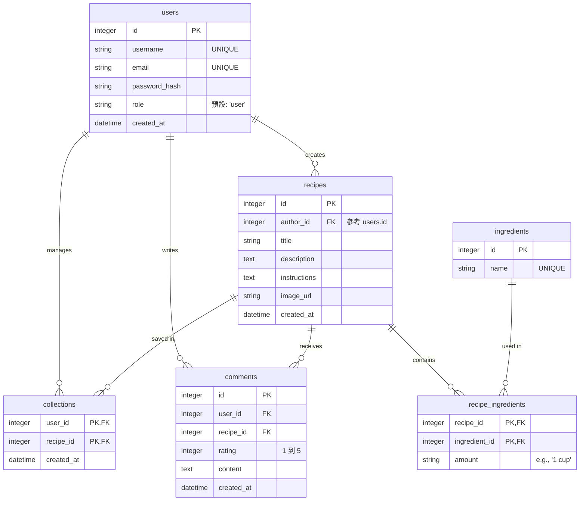

# 資料庫設計文件 (DB Design)

本文件描述食譜收藏夾系統的資料庫架構設計，包含 ER 圖、資料表結構說明，以及實體間的關聯設計。

## 1. 實體關係圖 (ER_Diagram)

## 2. 資料表詳細說明

### `users`
儲存使用者基本資料與登入資訊。
- `id` (INTEGER): 自動遞增的唯一識別碼 (Primary Key)。
- `username` (VARCHAR): 使用者名稱，必填且唯一。
- `email` (VARCHAR): 電子信箱，必填且唯一。
- `password_hash` (VARCHAR): 經過安全雜湊的密碼。
- `role` (VARCHAR): 使用者角色，例如 `user` 或 `admin`。
- `created_at` (DATETIME): 帳號建立時間。

### `recipes`
儲存食譜本身的主要資訊。
- `id` (INTEGER): 自動遞增的主鍵。
- `author_id` (INTEGER): 建立此食譜的使用者 ID (Foreign Key)。
- `title` (VARCHAR): 食譜標題。
- `description` (TEXT): 料理簡介。
- `instructions` (TEXT): 長篇幅的步驟說明。
- `image_url` (VARCHAR): 縮圖或主圖路徑/網址。
- `created_at` (DATETIME): 建立時間。

### `ingredients`
儲存單一食材名稱的字典表，方便精準搜尋。
- `id` (INTEGER): 自動遞增的主鍵。
- `name` (VARCHAR): 食材名稱（例如「高麗菜」），必須唯一。

### `recipe_ingredients` (多對多中介表)
紀錄某份食譜使用了哪些食材，以及份量。
- `recipe_id` (INTEGER): 參考 `recipes.id` (Foreign Key / Part of Composite PK)。
- `ingredient_id` (INTEGER): 參考 `ingredients.id` (Foreign Key / Part of Composite PK)。
- `amount` (VARCHAR): 該項食材的用量描述（如：適量、兩顆、300g）。

### `collections` (多對多中介表)
紀錄使用者收藏了哪些食譜。
- `user_id` (INTEGER): 參考 `users.id` (Foreign Key / PK)。
- `recipe_id` (INTEGER): 參考 `recipes.id` (Foreign Key / PK)。
- `created_at` (DATETIME): 收藏時間。

### `comments`
特定食譜下方，使用者的留言與評星表現。
- `id` (INTEGER): 自動遞增主鍵。
- `user_id` (INTEGER): 參考 `users.id`。
- `recipe_id` (INTEGER): 參考 `recipes.id`。
- `rating` (INTEGER): 1 到 5 分的評價星星。
- `content` (TEXT): 使用者的心得文字。
- `created_at` (DATETIME): 留言時間。
