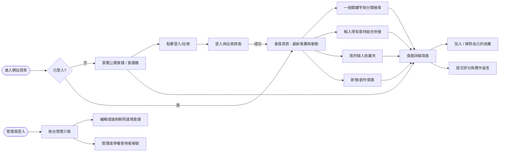
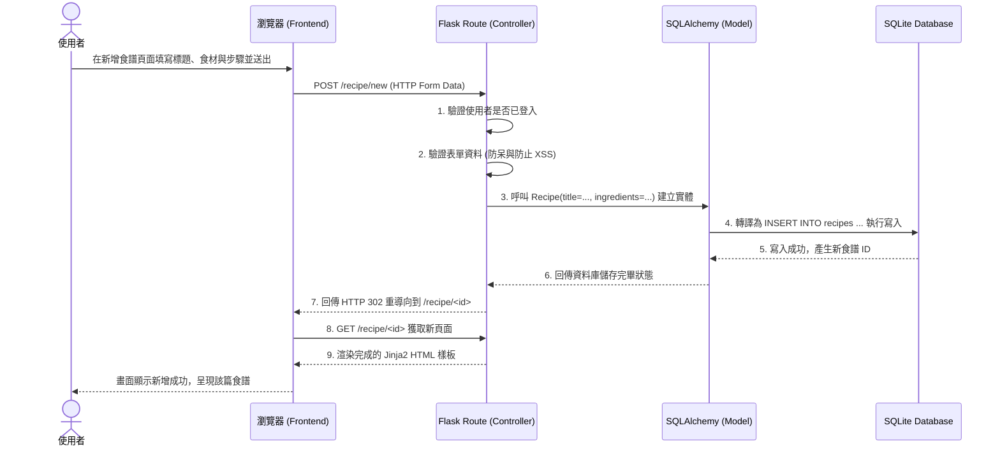

# 使用者流程與系統流程圖

這份文件根據 PRD 與系統架構文件所規劃，視覺化展示本食譜收藏夾系統的「使用者操作路徑」及「新增食譜的資料流序列」，幫助開發時對齊功能與資料處理流程。

## 1. 使用者流程圖 (User Flow)

這張圖呈現了使用者從抵達網站開始，如何登入、瀏覽、搜尋食譜，並延伸出「收藏」、「評價」以及「從食材找靈感」的操作路徑。也包含了管理員特有的後台路徑。

## 2. 系統序列圖 (Sequence Diagram)

這張圖描述了使用者在網站上「建立並提交一份新食譜」直到「成功寫入資料庫並回到頁面」的端到端過程。採用 Flask 的 Model-View-Controller 邏輯作為拆解基準。

## 3. 功能清單對照表

根據上述流程，這裡列出專案預計實作的主要功能、涵蓋的 HTTP 方法與預估規劃的 URL 路徑（依 Request 動作劃分）：

| 功能 | HTTP 方法 | URL 路徑 (預估) | 對應藍圖模組 (Blueprint) |
| --- | --- | --- | --- |
| 註冊帳號頁面與處理 | GET / POST | `/auth/register` | `auth.py` |
| 登入帳號頁面與處理 | GET / POST | `/auth/login` | `auth.py` |
| 登出帳號 | GET | `/auth/logout` | `auth.py` |
| **瀏覽首頁 (食譜牆)** | GET | `/` | `main.py` |
| 一般瀏覽與分類關鍵字搜尋 | GET | `/recipes` 或 `/search` | `main.py` |
| **食材組合搜尋專區** | GET / POST | `/search/ingredients` | `search.py` |
| **檢視單一食譜詳細內容** | GET | `/recipe/<id>` | `main.py` / `recipe.py` |
| 新增食譜頁面與處理 | GET / POST | `/recipe/new` | `recipe.py` |
| 編輯自己的食譜 | GET / POST | `/recipe/<id>/edit` | `recipe.py` |
| 刪除自己的食譜 | POST | `/recipe/<id>/delete` | `recipe.py` |
| **加入或移除我的收藏** | POST | `/recipe/<id>/collect` | `recipe.py` |
| 檢視個人收藏夾列表 | GET | `/collections` | `main.py` |
| **提交對食譜的評分與留言** | POST | `/recipe/<id>/comment` | `recipe.py` |
| (管理員) 進入後台首頁 | GET | `/admin` | `admin.py` |
| (管理員) 強制編輯/刪除食譜 | GET / POST | `/admin/recipe/<id>/...` | `admin.py` |
| (管理員) 管理使用者權限狀態 | GET / POST | `/admin/users` | `admin.py` |
